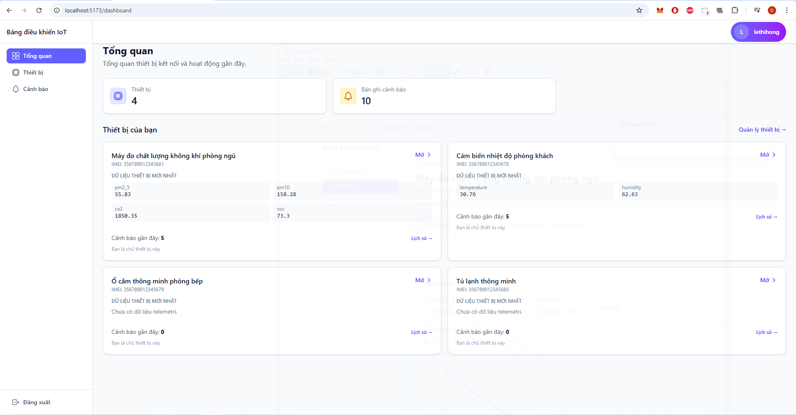
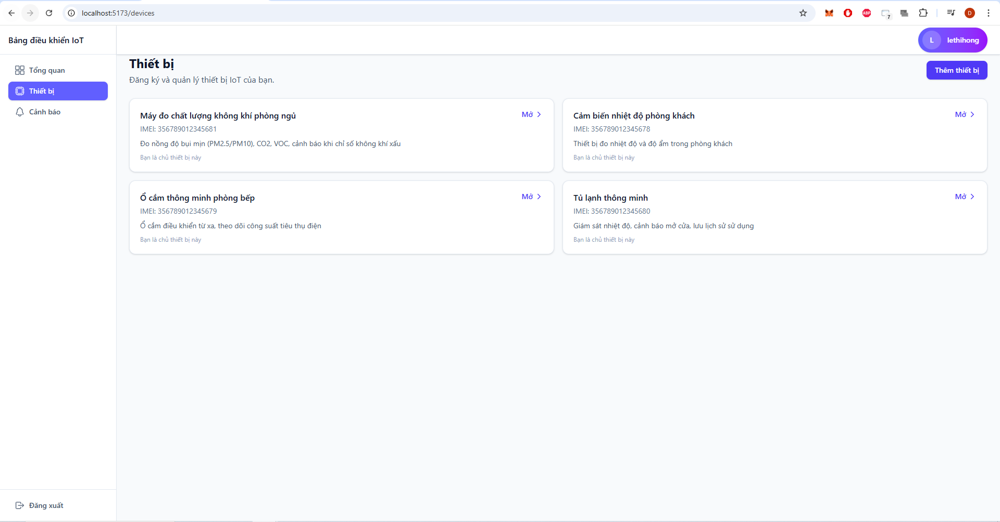
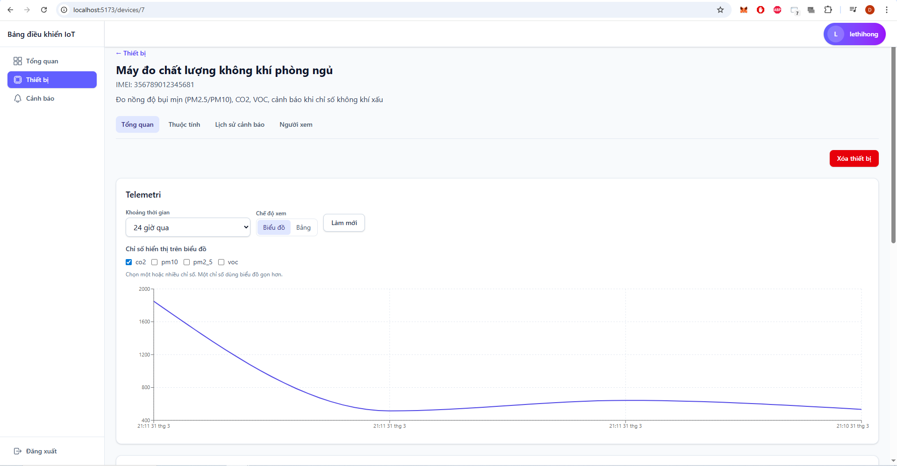
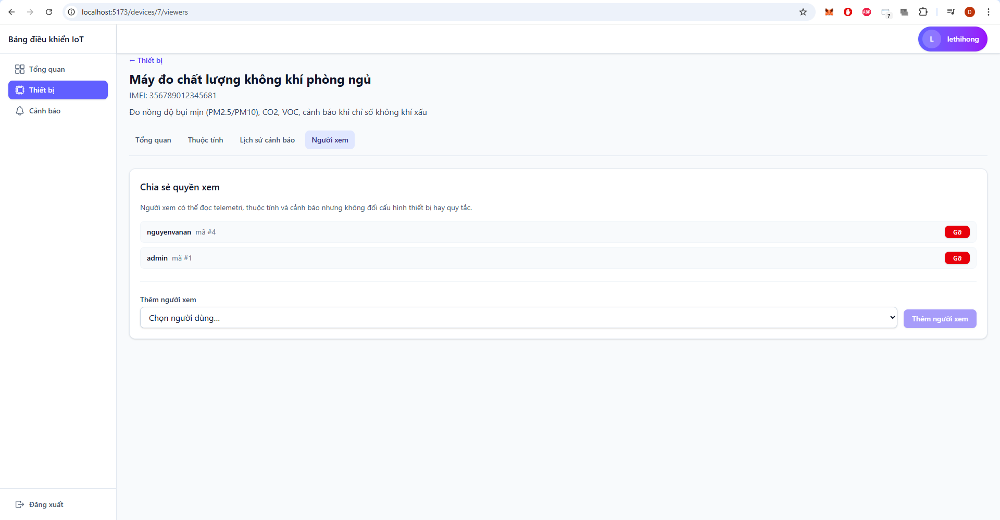
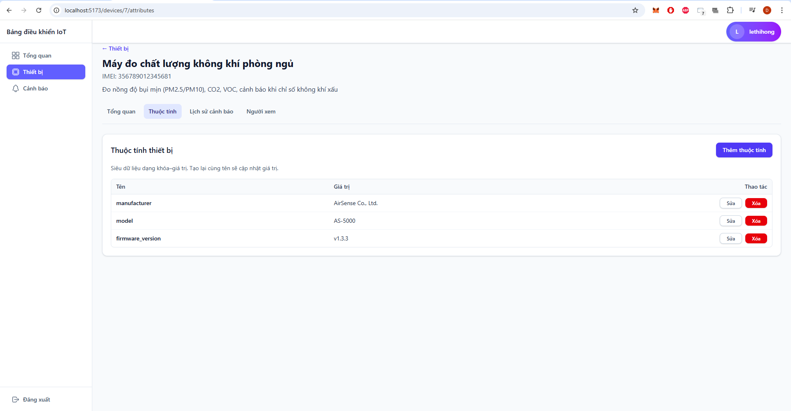
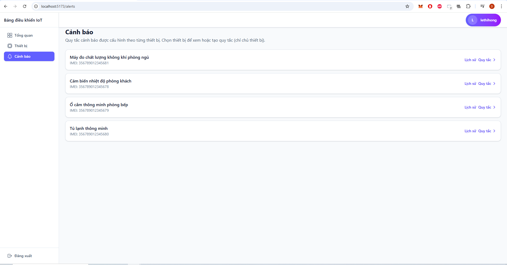
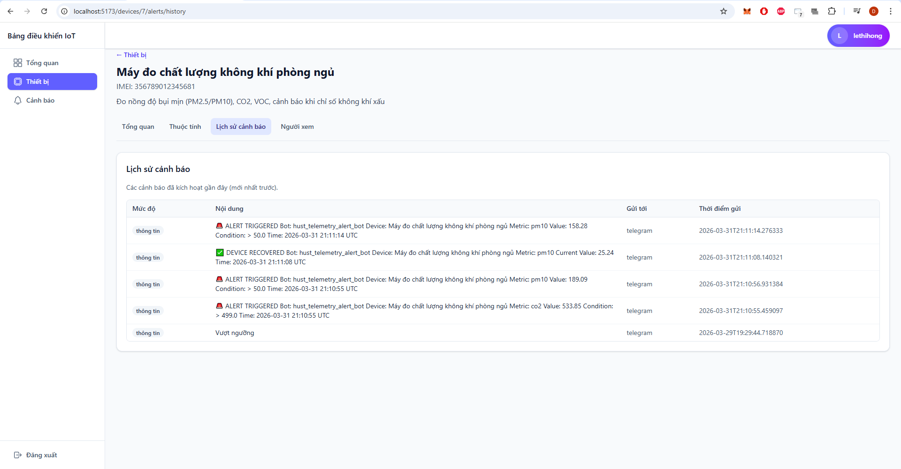

# IoT Device Platform

Nền tảng quản lý thiết bị IoT gồm backend API, frontend web dashboard và các script giả lập thiết bị gửi telemetry theo thời gian thực.

## 1) Tổng quan dự án

Hệ thống này giúp:

- Quản lý thiết bị IoT theo người dùng (owner/viewer).
- Thu thập telemetry từ thiết bị qua `device_token`.
- Hiển thị dữ liệu trực quan trên dashboard và trang chi tiết thiết bị.
- Cấu hình luật cảnh báo (alert rules) theo ngưỡng metric.
- Lưu lịch sử cảnh báo để theo dõi các sự kiện vượt ngưỡng.

Mục tiêu chính là cung cấp một nền tảng end-to-end cho bài toán: **thiết bị gửi dữ liệu -> hệ thống xử lý -> giao diện người dùng theo dõi và phản ứng**.

## 2) Kiến trúc hệ thống

### Thành phần chính

- **Frontend** (`frontend/`): React + Vite + Tailwind CSS, giao diện quản trị.
- **Backend** (`backend/`): FastAPI + SQLAlchemy, cung cấp REST API, xác thực và xử lý nghiệp vụ.
- **Database**: PostgreSQL (qua `psycopg2-binary`, cấu hình bằng `DATABASE_URL`).
- **Fake devices** (`fake_devices/`): script Python gửi telemetry mô phỏng dữ liệu cảm biến.

### Sơ đồ luồng tổng quát

```text
Fake Device (x-device-token)
        |
        v
POST /telemetry
        |
        v
FastAPI -> normalize telemetry -> save DB
        |
        +--> check alert rules -> gửi Telegram + save alert_history (sent_to="telegram")
        |
        v
Frontend gọi API /devices, /devices/{id}/telemetry, /alert-rules...
        |
        v
Dashboard / Device Overview / Alerts
```

## 3) Công nghệ sử dụng

### Frontend

- React 19
- React Router
- Axios
- Recharts (biểu đồ telemetry)
- Tailwind CSS 4
- Vite

### Backend

- FastAPI
- SQLAlchemy
- Pydantic / pydantic-settings
- Uvicorn
- PostgreSQL driver (`psycopg2-binary`)

### Runtime / Tooling

- Node.js + npm: dùng để chạy frontend (`vite`).
- Python 3.x + pip: dùng cho backend và fake devices.

## 4) Tính năng chính

- **Authentication**
  - Đăng ký, đăng nhập.
  - JWT access token cho frontend gọi API.
- **Device Management**
  - Tạo/xóa thiết bị.
  - Quản lý viewer cho thiết bị.
  - Quản lý thuộc tính thiết bị (attributes).
- **Telemetry**
  - Thiết bị gửi telemetry theo `x-device-token`.
  - Truy vấn lịch sử, latest telemetry, thống kê avg/max/min theo metric.
- **Dashboard**
  - Tổng quan số lượng thiết bị, cảnh báo, danh sách nhanh.
- **Alerts**
  - Tạo luật cảnh báo theo `metric + condition + threshold`.
  - Gửi cảnh báo Telegram thời gian thực qua bot `hust_telemetry_alert_bot`.
  - Chống spam: chỉ gửi khi chuyển trạng thái cảnh báo/phục hồi.
  - Có cơ chế cooldown để nhắc lại khi cảnh báo vẫn kéo dài.
  - Lưu lịch sử alert theo thiết bị.

## 5) Giải thích cấu trúc thư mục

```text
iot-device-platform/
├─ backend/
│  ├─ app/
│  │  ├─ api/               # FastAPI routes (auth, devices, telemetry, alerts, users)
│  │  ├─ services/          # Business logic
│  │  ├─ models/            # SQLAlchemy models
│  │  ├─ schemas/           # Pydantic schemas
│  │  ├─ dependencies/      # Auth/device permission dependencies
│  │  ├─ database/          # DB session + engine
│  │  ├─ utils/             # JWT, telemetry helpers...
│  │  └─ main.py            # FastAPI app entrypoint
│  ├─ requirements.txt
│  └─ .env                  # Env vars (DATABASE_URL...)
├─ frontend/
│  ├─ src/
│  │  ├─ pages/             # Dashboard, Devices, Alerts...
│  │  ├─ layouts/           # MainLayout, DeviceLayout, AuthLayout
│  │  ├─ components/        # UI components
│  │  ├─ hooks/             # Data hooks
│  │  ├─ services/          # Axios API client
│  │  └─ routes/            # Router config
│  ├─ package.json
│  └─ index.html
└─ fake_devices/
   ├─ device_4.py
   ├─ device_5.py
   └─ device_6.py
```

## 6) Hướng dẫn cài đặt và chạy local

## Yêu cầu môi trường

- Node.js 18+ (khuyến nghị bản LTS mới)
- Python 3.10+
- PostgreSQL đang chạy local hoặc remote

## Bước 1: Clone dự án

```bash
git clone <repo-url>
cd iot-device-platform
```

## Bước 2: Cấu hình backend

```bash
cd backend
python -m venv .venv
```

Kích hoạt môi trường ảo:

- Windows (PowerShell):

```powershell
.venv\Scripts\Activate.ps1
```

- macOS/Linux:

```bash
source .venv/bin/activate
```

Cài dependency:

```bash
pip install -r requirements.txt
```

Tạo/chỉnh sửa `.env` trong `backend/`:

```env
DATABASE_URL=postgresql://<user>:<password>@localhost:5432/<db_name>
TELEGRAM_BOT_TOKEN=<your_bot_token>
TELEGRAM_CHAT_ID=<your_chat_id>
```

Chạy backend:

```bash
uvicorn app.main:app --reload --host 0.0.0.0 --port 8000
```

Backend mặc định tại: `http://localhost:8000`

## Bước 3: Chạy frontend

Mở terminal mới:

```bash
cd frontend
npm install
npm run dev
```

Frontend mặc định tại: `http://localhost:5173`

## Bước 4 (tuỳ chọn): Chạy fake devices để đẩy telemetry

Mở terminal mới:

```bash
cd fake_devices
python device_4.py
```

Có thể chạy thêm `device_5.py`, `device_6.py` ở các terminal khác để tăng dữ liệu mô phỏng.

## 7) Mô tả API (các endpoint chính)

Base URL backend: `http://localhost:8000`

### Auth

- `POST /auth/register` - đăng ký tài khoản.
- `POST /auth/login` - đăng nhập, trả về JWT token.

### Users

- `GET /users/` - lấy danh sách user public (cần auth).

### Devices

- `POST /devices/` - tạo thiết bị.
- `GET /devices/` - danh sách thiết bị của user.
- `GET /devices/{device_id}` - chi tiết thiết bị.
- `DELETE /devices/{device_id}` - xóa thiết bị (owner).

### Telemetry (device/user)

- `POST /telemetry/` - thiết bị gửi telemetry (header `x-device-token`).
- `GET /devices/{device_id}/telemetry?limit=&from_time=&to_time=` - lịch sử telemetry.
- `GET /devices/{device_id}/telemetry/latest` - bản ghi mới nhất.
- `GET /devices/{device_id}/telemetry/stats?metric=` - thống kê metric.

### Attributes / Viewers

- `POST /devices/{device_id}/attributes`
- `GET /devices/{device_id}/attributes`
- `DELETE /devices/{device_id}/attributes/{attribute_id}`
- `GET /devices/{device_id}/viewers`
- `POST /devices/{device_id}/viewers?user_id=`
- `DELETE /devices/{device_id}/viewers/{viewer_user_id}`

### Alert rules & history

- `POST /alert-rules/` - tạo alert rule.
- `GET /alert-rules/{device_id}` - danh sách rules theo device.
- `PATCH /alert-rules/rules/{rule_id}` - cập nhật rule.
- `GET /alert-rules/device/{device_id}?limit=` - lịch sử alert theo device.

## 8) Data flow chi tiết (device -> backend -> frontend -> alert)

1. **Device gửi telemetry**  
   Thiết bị gọi `POST /telemetry/` kèm header `x-device-token`.

2. **Backend xác thực thiết bị**  
   Dependency `verify_device` kiểm tra token với bảng `devices`.

3. **Lưu dữ liệu telemetry**  
   Service chuẩn hoá dữ liệu (`normalize_telemetry_data`) rồi ghi vào bảng `telemetry`.

4. **Đánh giá alert rules**  
   Sau khi lưu telemetry, backend chạy `check_alerts()`:
   - Lấy các rule đang bật của thiết bị.
   - Đọc giá trị metric từ payload.
   - So sánh với điều kiện (`>`, `<`, `>=`, `<=`, `==`).
   - Gửi tin nhắn khi chuyển trạng thái `NORMAL -> ALERT`, `ALERT -> NORMAL`.
   - Nếu vẫn `ALERT`, chỉ nhắc lại khi vượt `cooldown_seconds`.
   - Ghi lịch sử vào `alert_history`.

5. **Frontend cập nhật hiển thị**  
   Frontend gọi API telemetry/stats/alerts để render chart, bảng và lịch sử cảnh báo theo thời gian thực (refresh theo thao tác người dùng).

## 9) Tích hợp cảnh báo Telegram

Backend đã tích hợp gửi cảnh báo Telegram thực tế qua bot `hust_telemetry_alert_bot`.

### Cấu hình

- Đọc biến môi trường từ `backend/.env`:
  - `TELEGRAM_BOT_TOKEN`
  - `TELEGRAM_CHAT_ID`
- Cấu hình được nạp qua `BaseSettings` trong `app/config/settings.py`.

### Cách backend gửi tin nhắn

- Service `app/services/telegram_service.py` gửi `POST` tới Telegram Bot API:
  - `https://api.telegram.org/bot{TELEGRAM_BOT_TOKEN}/sendMessage`
- Payload:
  - `chat_id = TELEGRAM_CHAT_ID`
  - `text = message`
- Có xử lý lỗi và log khi gửi thất bại.

### Loại tin nhắn

- `ALERT TRIGGERED`: khi cảnh báo vừa được kích hoạt.
- `ALERT STILL ACTIVE`: khi cảnh báo còn tồn tại và đã vượt thời gian cooldown.
- `DEVICE RECOVERED`: khi giá trị quay về trạng thái bình thường.

### Cơ chế chống spam

- Chỉ gửi khi có chuyển trạng thái:
  - `NORMAL -> ALERT`
  - `ALERT -> NORMAL`
- Nếu thiết bị vẫn đang `ALERT`, hệ thống không gửi lặp liên tục, chỉ gửi nhắc lại sau mỗi `cooldown_seconds`.

## 10) Giao diện người dùng

## Dashboard

Trang tổng quan hệ thống, hiển thị số lượng thiết bị, cảnh báo và danh sách thiết bị nổi bật.



_Replace with actual screenshot_

## Devices

Trang quản lý danh sách thiết bị: xem thông tin, điều hướng sang trang chi tiết thiết bị.



_Replace with actual screenshot_

## Device Overview

Trang theo dõi chi tiết telemetry của một thiết bị: biểu đồ, bảng dữ liệu, thống kê metric và quản lý alert rules.







_Replace with actual screenshot_

## Alerts

Trang theo dõi cảnh báo: danh sách luật cảnh báo và lịch sử các lần trigger theo thiết bị.





_Replace with actual screenshot_

## 11) Gợi ý phát triển tiếp

- Bổ sung retry queue cho Telegram sender khi gặp lỗi mạng/API.
- Thêm migration tool (Alembic) thay vì `create_all`.
- Tách secret/JWT key ra biến môi trường.
- Thêm test tự động cho API và hooks frontend.
- Docker Compose để chạy toàn bộ stack 1 lệnh.
